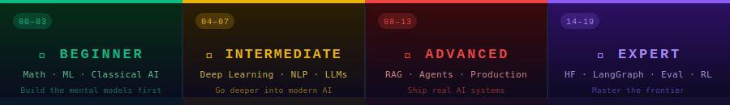

  

 

&nbsp;
&nbsp;
&nbsp;

 

*Story-first &nbsp;·&nbsp; Visual &nbsp;·&nbsp; Code-included &nbsp;·&nbsp; Interview-ready*

 

## ⚡ The Learning Stack

| | | | | | | | | |
|:---:|:---:|:---:|:---:|:---:|:---:|:---:|:---:|:---:|
| 📐 | `→` | 🤖 | `→` | 🧬 | `→` | 💬 | `→` | 🚀 |
| **Math** | | **ML** | | **Deep Learning** | | **LLMs** | | **Production** |

## 🗺️ Section Overview

<table>
<tr>
<td align="center" width="130"><a href="./00_Learning_Guide/"><b>🗺️</b> <code>00</code> Learning Guide</a></td>
<td align="center" width="130"><a href="./01_Math_for_AI/"><b>📐</b> <code>01</code> Math for AI</a></td>
<td align="center" width="130"><a href="./02_Machine_Learning_Foundations/"><b>🤖</b> <code>02</code> ML Foundations</a></td>
<td align="center" width="130"><a href="./03_Classical_ML_Algorithms/"><b>🌲</b> <code>03</code> Classical ML</a></td>
<td align="center" width="130"><a href="./04_Neural_Networks_and_Deep_Learning/"><b>🧬</b> <code>04</code> Neural Networks</a></td>
<td align="center" width="130"><a href="./05_NLP_Foundations/"><b>📝</b> <code>05</code> NLP Foundations</a></td>
<td align="center" width="130"><a href="./06_Transformers/"><b>⚡</b> <code>06</code> Transformers</a></td>
</tr>
<tr>
<td align="center"><a href="./07_Large_Language_Models/"><b>💬</b> <code>07</code> LLMs</a></td>
<td align="center"><a href="./08_LLM_Applications/"><b>🛠️</b> <code>08</code> LLM Applications</a></td>
<td align="center"><a href="./09_RAG_Systems/"><b>🔍</b> <code>09</code> RAG Systems</a></td>
<td align="center"><a href="./10_AI_Agents/"><b>🤖</b> <code>10</code> AI Agents</a></td>
<td align="center"><a href="./11_MCP_Model_Context_Protocol/"><b>🔌</b> <code>11</code> MCP Protocol</a></td>
<td align="center"><a href="./12_Production_AI/"><b>🚀</b> <code>12</code> Production AI</a></td>
<td align="center"><a href="./13_AI_System_Design/"><b>🏗️</b> <code>13</code> System Design</a></td>
</tr>
<tr>
<td align="center"><a href="./14_Hugging_Face_Ecosystem/"><b>🤗</b> <code>14</code> Hugging Face</a></td>
<td align="center"><a href="./15_LangGraph/"><b>🕸️</b> <code>15</code> LangGraph</a></td>
<td align="center"><a href="./16_Diffusion_Models/"><b>🎨</b> <code>16</code> Diffusion Models</a></td>
<td align="center"><a href="./17_Multimodal_AI/"><b>👁️</b> <code>17</code> Multimodal AI</a></td>
<td align="center"><a href="./18_AI_Evaluation/"><b>📊</b> <code>18</code> AI Evaluation</a></td>
<td align="center"><a href="./19_Reinforcement_Learning/"><b>🎮</b> <code>19</code> Reinforcement Learning</a></td>
<td align="center"><a href="./21_Claude_Mastery/"><b>🧠</b> <code>21</code> Claude Mastery</a></td>
</tr>
</table>

## 📚 Full Curriculum

> Click any section to expand every topic inside.

 

<kbd>&nbsp;00&nbsp;</kbd>&nbsp; 🗺️ &nbsp;<b>Learning Guide</b>&nbsp; — &nbsp;<i>Your map through the entire atlas</i>

 

| | File | What It Does |
|:---:|---|---|
| 🗺️ | [How to Use This Repo](./00_Learning_Guide/How_to_Use_This_Repo.md) | Navigation guide + file type explanations |
| ➡️ | [Learning Path](./00_Learning_Guide/Learning_Path.md) | Linear progression with visual flowchart |
| ✅ | [Progress Tracker](./00_Learning_Guide/Progress_Tracker.md) | Personal checklist to track what you've covered |

 

<kbd>&nbsp;01&nbsp;</kbd>&nbsp; 📐 &nbsp;<b>Math for AI</b>&nbsp; <code>5 topics</code>&nbsp; — &nbsp;<i>The foundation everything else stands on</i>

 

| Topic | What You'll Learn | Bonus Files |
|---|---|---|
| [Probability](./01_Math_for_AI/01_Probability/) | Sample spaces, Bayes' theorem, distributions, conditional probability | Intuition + Exercises |
| [Statistics](./01_Math_for_AI/02_Statistics/) | Hypothesis testing, confidence intervals, p-values, distributions | Intuition + Exercises |
| [Linear Algebra](./01_Math_for_AI/03_Linear_Algebra/) | Vectors, matrices, dot products, eigenvalues, SVD | Vectors & Matrices guide |
| [Calculus & Optimization](./01_Math_for_AI/04_Calculus_and_Optimization/) | Derivatives, chain rule, gradient, the optimization landscape | Gradient intuition |
| [Information Theory](./01_Math_for_AI/05_Information_Theory/) | Entropy, cross-entropy, KL divergence, mutual information | — |

> Each topic: `Theory.md` · `Cheatsheet.md` · `Interview_QA.md` · `Intuition_First.md` · `Mini_Exercise.md`

 

<kbd>&nbsp;02&nbsp;</kbd>&nbsp; 🤖 &nbsp;<b>Machine Learning Foundations</b>&nbsp; <code>10 topics</code>&nbsp; — &nbsp;<i>How machines actually learn</i>

 

| Topic | What You'll Learn |
|---|---|
| [What is ML](./02_Machine_Learning_Foundations/01_What_is_ML/) | ML vs traditional programming, types of ML, mental model |
| [Training vs Inference](./02_Machine_Learning_Foundations/02_Training_vs_Inference/) | The two phases, compute costs, deployment implications |
| [Supervised Learning](./02_Machine_Learning_Foundations/03_Supervised_Learning/) | Labeled data, regression vs classification, decision boundaries |
| [Unsupervised Learning](./02_Machine_Learning_Foundations/04_Unsupervised_Learning/) | Clustering, dimensionality reduction, anomaly detection |
| [Model Evaluation](./02_Machine_Learning_Foundations/05_Model_Evaluation/) | Train/val/test splits, cross-validation, precision, recall, AUC |
| [Overfitting & Regularization](./02_Machine_Learning_Foundations/06_Overfitting_and_Regularization/) | Underfitting, overfitting, L1/L2, dropout |
| [Feature Engineering](./02_Machine_Learning_Foundations/07_Feature_Engineering/) | Encoding, scaling, feature selection, pipelines |
| [Gradient Descent](./02_Machine_Learning_Foundations/08_Gradient_Descent/) | SGD, mini-batch, learning rate, convergence |
| [Loss Functions](./02_Machine_Learning_Foundations/09_Loss_Functions/) | MSE, cross-entropy, hinge loss — when to use what |
| [Bias vs Variance](./02_Machine_Learning_Foundations/10_Bias_vs_Variance/) | The tradeoff, model complexity, error decomposition |

> Each topic: `Theory.md` · `Cheatsheet.md` · `Interview_QA.md` · `Code_Example.md` (most)

 

<kbd>&nbsp;03&nbsp;</kbd>&nbsp; 🌲 &nbsp;<b>Classical ML Algorithms</b>&nbsp; <code>12 algorithms</code>&nbsp; — &nbsp;<i>The workhorses of machine learning</i>

 

| Algorithm | What You'll Learn | Extras |
|---|---|---|
| [Linear Regression](./03_Classical_ML_Algorithms/01_Linear_Regression/) | OLS, gradient descent, R², residuals, assumptions | Math intuition |
| [Logistic Regression](./03_Classical_ML_Algorithms/02_Logistic_Regression/) | Sigmoid, decision threshold, multiclass | Math intuition |
| [Decision Trees](./03_Classical_ML_Algorithms/03_Decision_Trees/) | Gini impurity, entropy, pruning, CART | Code example |
| [Random Forests](./03_Classical_ML_Algorithms/04_Random_Forests/) | Bagging, feature randomness, feature importance | Code example |
| [SVM](./03_Classical_ML_Algorithms/05_SVM/) | Hyperplanes, margins, kernels, the kernel trick | Math intuition |
| [K-Means Clustering](./03_Classical_ML_Algorithms/06_K_Means_Clustering/) | Centroids, elbow method, inertia, limitations | Code example |
| [PCA](./03_Classical_ML_Algorithms/07_PCA_Dimensionality_Reduction/) | Eigenvectors, variance explained, dimensionality reduction | Math intuition |
| [Naive Bayes](./03_Classical_ML_Algorithms/08_Naive_Bayes/) | Bayes theorem applied, independence assumption, spam filter | Code example |
| [XGBoost & Boosting](./03_Classical_ML_Algorithms/09_XGBoost_and_Boosting/) | Gradient boosting, XGBoost/LightGBM, hyperparameter tuning | — |
| [Time Series Analysis](./03_Classical_ML_Algorithms/10_Time_Series_Analysis/) | ARIMA, Prophet, trend/seasonality decomposition, LSTM for TS | — |
| [Recommendation Systems](./03_Classical_ML_Algorithms/11_Recommendation_Systems/) | Collaborative filtering, content-based, matrix factorization, cold start | — |
| [Anomaly Detection](./03_Classical_ML_Algorithms/12_Anomaly_Detection/) | Isolation Forest, LOF, SMOTE, class imbalance, PR-AUC vs ROC-AUC | — |

> ⭐ [Algorithm Comparison Guide](./03_Classical_ML_Algorithms/Algorithm_Comparison.md) — decision flowchart for choosing the right one

 

<kbd>&nbsp;04&nbsp;</kbd>&nbsp; 🧬 &nbsp;<b>Neural Networks & Deep Learning</b>&nbsp; <code>12 topics</code>&nbsp; — &nbsp;<i>From a single neuron to state-of-the-art architectures</i>

 

| Topic | What You'll Learn |
|---|---|
| [Perceptron](./04_Neural_Networks_and_Deep_Learning/01_Perceptron/) | Biological neuron analogy, linear classifier, XOR problem |
| [Multi-Layer Perceptrons](./04_Neural_Networks_and_Deep_Learning/02_MLPs/) | Hidden layers, universal approximation, depth vs width |
| [Activation Functions](./04_Neural_Networks_and_Deep_Learning/03_Activation_Functions/) | Sigmoid, tanh, ReLU, GELU — what, why, and comparison |
| [Loss Functions](./04_Neural_Networks_and_Deep_Learning/04_Loss_Functions/) | Cross-entropy, MSE, contrastive loss for neural networks |
| [Forward Propagation](./04_Neural_Networks_and_Deep_Learning/05_Forward_Propagation/) | The full forward pass, matrix math, layer outputs |
| [Backpropagation](./04_Neural_Networks_and_Deep_Learning/06_Backpropagation/) | Chain rule, gradient flow, computational graphs |
| [Optimizers](./04_Neural_Networks_and_Deep_Learning/07_Optimizers/) | SGD → Momentum → RMSProp → Adam — full comparison |
| [Regularization](./04_Neural_Networks_and_Deep_Learning/08_Regularization/) | Dropout, batch norm, weight decay, early stopping |
| [CNNs](./04_Neural_Networks_and_Deep_Learning/09_CNNs/) | Convolutions, pooling, filters, ResNet, EfficientNet |
| [RNNs](./04_Neural_Networks_and_Deep_Learning/10_RNNs/) | Sequential data, vanishing gradients, LSTMs, GRUs |
| [GANs](./04_Neural_Networks_and_Deep_Learning/11_GANs/) | Generator vs discriminator, training dynamics, mode collapse |
| [Training Techniques](./04_Neural_Networks_and_Deep_Learning/12_Training_Techniques/) | Transfer learning, mixed precision, gradient clipping |

 

<kbd>&nbsp;05&nbsp;</kbd>&nbsp; 📝 &nbsp;<b>NLP Foundations</b>&nbsp; <code>7 topics</code>&nbsp; — &nbsp;<i>How machines read and understand text</i>

 

| Topic | What You'll Learn |
|---|---|
| [Text Preprocessing](./05_NLP_Foundations/01_Text_Preprocessing/) | Cleaning, stemming, lemmatization, stop words |
| [Tokenization](./05_NLP_Foundations/02_Tokenization/) | Word, subword, BPE, sentencepiece — how LLMs split text |
| [Bag of Words & TF-IDF](./05_NLP_Foundations/03_Bag_of_Words_TF_IDF/) | Sparse representations, term frequency, inverse doc frequency |
| [Word Embeddings](./05_NLP_Foundations/04_Word_Embeddings/) | Word2Vec, GloVe, FastText, the semantic vector space |
| [Semantic Similarity](./05_NLP_Foundations/05_Semantic_Similarity/) | Cosine similarity, sentence embeddings, nearest neighbor search |
| [Hidden Markov Models](./05_NLP_Foundations/06_Hidden_Markov_Models/) | Sequence labeling, Viterbi algorithm, POS tagging |
| [Conditional Random Fields](./05_NLP_Foundations/07_Conditional_Random_Fields/) | Structured prediction, NER, CRF vs HMM |

 

<kbd>&nbsp;06&nbsp;</kbd>&nbsp; ⚡ &nbsp;<b>Transformers</b>&nbsp; <code>10 topics</code>&nbsp; — &nbsp;<i>The architecture that changed everything</i>

 

| Topic | What You'll Learn |
|---|---|
| [Before Transformers](./06_Transformers/01_Sequence_Models_Before_Transformers/) | RNN/LSTM bottlenecks, seq-to-seq, the motivation for attention |
| [Attention Mechanism](./06_Transformers/02_Attention_Mechanism/) | Query/Key/Value intuition, dot-product attention, softmax weights |
| [Self-Attention](./06_Transformers/03_Self_Attention/) | How tokens attend to each other, contextual representations |
| [Multi-Head Attention](./06_Transformers/04_Multi_Head_Attention/) | Parallel attention heads, different representation subspaces |
| [Positional Encoding](./06_Transformers/05_Positional_Encoding/) | Sinusoidal encoding, learned positions, RoPE |
| [Transformer Architecture](./06_Transformers/06_Transformer_Architecture/) | Full encoder-decoder, layer norm, residual connections, FFN |
| [Encoder-Decoder Models](./06_Transformers/07_Encoder_Decoder_Models/) | T5, BART — sequence-to-sequence tasks |
| [BERT](./06_Transformers/08_BERT/) | Masked LM, bidirectionality, fine-tuning for downstream tasks |
| [GPT](./06_Transformers/09_GPT/) | Autoregressive generation, causal masking, scaling laws |
| [Vision Transformers](./06_Transformers/10_Vision_Transformers/) | Image patches as tokens, ViT architecture, CLIP |

 

<kbd>&nbsp;07&nbsp;</kbd>&nbsp; 💬 &nbsp;<b>Large Language Models</b>&nbsp; <code>11 topics</code>&nbsp; — &nbsp;<i>How modern AI thinks, learns, and speaks</i>

 

| Topic | What You'll Learn | Extras |
|---|---|---|
| [LLM Fundamentals](./07_Large_Language_Models/01_LLM_Fundamentals/) | What an LLM is, scale, emergent capabilities | History timeline |
| [How LLMs Generate Text](./07_Large_Language_Models/02_How_LLMs_Generate_Text/) | Tokenization, logits, sampling, temperature, top-p, top-k | — |
| [Pretraining](./07_Large_Language_Models/03_Pretraining/) | Self-supervised learning, next-token prediction, data curation | — |
| [Fine-Tuning](./07_Large_Language_Models/04_Fine_Tuning/) | Full fine-tune vs LoRA vs QLoRA — when and how | — |
| [Instruction Tuning](./07_Large_Language_Models/05_Instruction_Tuning/) | SFT, instruction datasets, chat templates | — |
| [RLHF](./07_Large_Language_Models/06_RLHF/) | Reward models, PPO, DPO — aligning AI with human preferences | — |
| [Context Windows & Tokens](./07_Large_Language_Models/07_Context_Windows_and_Tokens/) | Context limits, long-context models, token counting | Cost guide |
| [Hallucination & Alignment](./07_Large_Language_Models/08_Hallucination_and_Alignment/) | Why models confabulate, detection, mitigation | Mitigation guide |
| [Using LLM APIs](./07_Large_Language_Models/09_Using_LLM_APIs/) | Anthropic & OpenAI APIs, streaming, error handling | Code cookbook |
| [Ollama & Local LLMs](./07_Large_Language_Models/10_Ollama_Local_LLMs/) | Run LLMs locally, GGUF quantization, REST API, local RAG | — |
| [Reasoning Models](./07_Large_Language_Models/11_Reasoning_Models/) | Chain-of-thought, o1/o3/Claude extended thinking, when to use | — |

 

<kbd>&nbsp;08&nbsp;</kbd>&nbsp; 🛠️ &nbsp;<b>LLM Applications</b>&nbsp; <code>8 topics</code>&nbsp; — &nbsp;<i>Build real things with LLMs</i>

 

| Topic | What You'll Learn | Extras |
|---|---|---|
| [Prompt Engineering](./08_LLM_Applications/01_Prompt_Engineering/) | Zero-shot, few-shot, CoT, system prompts | Patterns + Common mistakes |
| [Tool Calling](./08_LLM_Applications/02_Tool_Calling/) | Function calling, schemas, parallel tools, agent loops | Architecture deep dive |
| [Structured Outputs](./08_LLM_Applications/03_Structured_Outputs/) | JSON mode, schema enforcement, extraction pipelines | — |
| [Embeddings](./08_LLM_Applications/04_Embeddings/) | Embedding models, dimensionality, use cases, batching | — |
| [Vector Databases](./08_LLM_Applications/05_Vector_Databases/) | Pinecone, Weaviate, pgvector, FAISS | Comparison guide |
| [Semantic Search](./08_LLM_Applications/06_Semantic_Search/) | Dense retrieval, hybrid search, re-ranking | — |
| [Memory Systems](./08_LLM_Applications/07_Memory_Systems/) | In-context, external, episodic, semantic architectures | — |
| [Streaming Responses](./08_LLM_Applications/08_Streaming_Responses/) | SSE, streaming tokens, progressive UI, backpressure | — |

 

<kbd>&nbsp;09&nbsp;</kbd>&nbsp; 🔍 &nbsp;<b>RAG Systems</b>&nbsp; <code>11 topics + build project</code>&nbsp; — &nbsp;<i>Ground AI in real knowledge</i>

 

| Topic | What You'll Learn |
|---|---|
| [RAG Fundamentals](./09_RAG_Systems/01_RAG_Fundamentals/) | Why RAG exists, architecture overview, when to use it |
| [Document Ingestion](./09_RAG_Systems/02_Document_Ingestion/) | PDF, HTML, markdown parsing, metadata extraction |
| [Chunking Strategies](./09_RAG_Systems/03_Chunking_Strategies/) | Fixed, recursive, semantic chunking — comparison guide |
| [Embedding & Indexing](./09_RAG_Systems/04_Embedding_and_Indexing/) | Embedding models, HNSW, IVF, indexing pipelines |
| [Retrieval Pipeline](./09_RAG_Systems/05_Retrieval_Pipeline/) | Top-k, MMR, re-ranking, hybrid search |
| [Context Assembly](./09_RAG_Systems/06_Context_Assembly/) | Prompt construction, context window management, deduplication |
| [Advanced RAG](./09_RAG_Systems/07_Advanced_RAG_Techniques/) | HyDE, query rewriting, RAPTOR, multi-hop retrieval |
| [RAG Evaluation](./09_RAG_Systems/08_RAG_Evaluation/) | RAGAS metrics, faithfulness, answer relevance, context recall |
| [🔨 Build a RAG App](./09_RAG_Systems/09_Build_a_RAG_App/) | **End-to-end project** — architecture → code → deploy → troubleshoot |
| [GraphRAG](./09_RAG_Systems/10_GraphRAG/) | Knowledge graphs, community detection, local vs global search |
| [CAG — Cache-Augmented Generation](./09_RAG_Systems/11_CAG_Cache_Augmented_Generation/) | KV cache reuse, prompt caching APIs, CAG vs RAG comparison |

> ⭐ [Full Pipeline Overview](./09_RAG_Systems/Full_Pipeline_Overview.md) — single-page reference for the entire RAG stack

 

<kbd>&nbsp;10&nbsp;</kbd>&nbsp; 🤖 &nbsp;<b>AI Agents</b>&nbsp; <code>9 topics + capstone</code>&nbsp; — &nbsp;<i>Build AI that reasons, acts, and remembers</i>

 

| Topic | What You'll Learn |
|---|---|
| [Agent Fundamentals](./10_AI_Agents/01_Agent_Fundamentals/) | The agent loop, perception → reasoning → action cycle |
| [ReAct Pattern](./10_AI_Agents/02_ReAct_Pattern/) | Thought → Action → Observation loop, CoT in agents |
| [Tool Use](./10_AI_Agents/03_Tool_Use/) | Tool schemas, execution, error recovery, tool selection |
| [Agent Memory](./10_AI_Agents/04_Agent_Memory/) | Working, episodic, semantic, procedural memory types |
| [Planning & Reasoning](./10_AI_Agents/05_Planning_and_Reasoning/) | Tree-of-thought, task decomposition, plan-then-act |
| [Reflection & Self-Correction](./10_AI_Agents/06_Reflection_and_Self_Correction/) | Self-evaluation, iterative refinement, critic agents |
| [Multi-Agent Systems](./10_AI_Agents/07_Multi_Agent_Systems/) | Orchestrator-worker, debate, specialization patterns |
| [Agent Frameworks](./10_AI_Agents/08_Agent_Frameworks/) | LangChain, CrewAI, AutoGen — when to use each |
| [🔨 Build an Agent](./10_AI_Agents/09_Build_an_Agent/) | **Capstone project** — full ReAct agent from scratch |

> ⭐ [Agent vs Chain vs RAG](./10_AI_Agents/Agent_vs_Chain_vs_RAG.md) — decision guide for picking the right pattern

 

<kbd>&nbsp;11&nbsp;</kbd>&nbsp; 🔌 &nbsp;<b>MCP — Model Context Protocol</b>&nbsp; <code>9 topics</code>&nbsp; — &nbsp;<i>The USB standard for AI tools</i>

 

| Topic | What You'll Learn |
|---|---|
| [MCP Fundamentals](./11_MCP_Model_Context_Protocol/01_MCP_Fundamentals/) | Why MCP exists, the USB-C analogy, what problem it solves |
| [MCP Architecture](./11_MCP_Model_Context_Protocol/02_MCP_Architecture/) | Host → Client → Server model, protocol layers |
| [Hosts, Clients, Servers](./11_MCP_Model_Context_Protocol/03_Hosts_Clients_Servers/) | Roles, responsibilities, lifecycle, message flow |
| [Tools, Resources, Prompts](./11_MCP_Model_Context_Protocol/04_Tools_Resources_Prompts/) | The three primitives — definitions, schemas, use cases |
| [Transport Layer](./11_MCP_Model_Context_Protocol/05_Transport_Layer/) | stdio vs SSE, when to use each, connection management |
| [Building an MCP Server](./11_MCP_Model_Context_Protocol/06_Building_an_MCP_Server/) | Full walkthrough — schema → handler → registration → test |
| [Security & Permissions](./11_MCP_Model_Context_Protocol/07_Security_and_Permissions/) | OAuth, capability scoping, prompt injection defense |
| [MCP Ecosystem](./11_MCP_Model_Context_Protocol/08_MCP_Ecosystem/) | Official servers, community tools, Claude Desktop, IDEs |
| [Connect MCP to Agents](./11_MCP_Model_Context_Protocol/09_Connect_MCP_to_Agents/) | Wiring MCP servers into agent loops |

 

<kbd>&nbsp;12&nbsp;</kbd>&nbsp; 🚀 &nbsp;<b>Production AI</b>&nbsp; <code>9 topics</code>&nbsp; — &nbsp;<i>What separates a demo from a deployed system</i>

 

| Topic | What You'll Learn |
|---|---|
| [Model Serving](./12_Production_AI/01_Model_Serving/) | REST vs gRPC, batching, replicas, serverless vs dedicated |
| [Latency Optimization](./12_Production_AI/02_Latency_Optimization/) | Quantization, speculative decoding, KV cache, streaming |
| [Cost Optimization](./12_Production_AI/03_Cost_Optimization/) | Token reduction, prompt caching, model routing, tiering |
| [Caching Strategies](./12_Production_AI/04_Caching_Strategies/) | Exact-match, semantic, prompt caching — tools and patterns |
| [Observability](./12_Production_AI/05_Observability/) | Logs, metrics, traces, LLM-specific telemetry |
| [Evaluation Pipelines](./12_Production_AI/06_Evaluation_Pipelines/) | LLM-as-judge, regression testing, CI/CD for AI |
| [Safety & Guardrails](./12_Production_AI/07_Safety_and_Guardrails/) | Prompt injection defense, output validation, content filtering |
| [Fine-Tuning in Production](./12_Production_AI/08_Fine_Tuning_in_Production/) | LoRA, QLoRA, continuous retraining, dataset curation |
| [Scaling AI Apps](./12_Production_AI/09_Scaling_AI_Apps/) | Horizontal scaling, queue architecture, auto-scaling |

 

<kbd>&nbsp;13&nbsp;</kbd>&nbsp; 🏗️ &nbsp;<b>AI System Design</b>&nbsp; <code>5 real-world blueprints</code>&nbsp; — &nbsp;<i>Interview-ready. Production-grade.</i>

 

> **Start here →** [System Design Framework](./13_AI_System_Design/System_Design_Framework.md) — 5-step approach: Clarify → Scale → Data → Components → Deploy

 

| System | What You'll Design |
|---|---|
| [Customer Support Agent](./13_AI_System_Design/01_Customer_Support_Agent/) | Intent detection, tool calling, escalation, memory |
| [RAG Document Search](./13_AI_System_Design/02_RAG_Document_Search/) | Ingestion pipeline, hybrid retrieval, ranking, UI |
| [AI Coding Assistant](./13_AI_System_Design/03_AI_Coding_Assistant/) | Context window management, repo indexing, tool use |
| [AI Research Assistant](./13_AI_System_Design/04_AI_Research_Assistant/) | Multi-step reasoning, web retrieval, citation tracking |
| [Multi-Agent Workflow](./13_AI_System_Design/05_Multi_Agent_Workflow/) | Orchestration, inter-agent comms, fault tolerance |

> Each case study: Architecture Blueprint · Build Guide · Component Breakdown · Data Flow Diagram · Tech Stack · Interview Q&A

 

<kbd>&nbsp;14&nbsp;</kbd>&nbsp; 🤗 &nbsp;<b>Hugging Face Ecosystem</b>&nbsp; <code>7 topics</code>&nbsp; — &nbsp;<i>The practical toolkit every AI engineer uses daily</i>

 

| Topic | What You'll Learn | Extras |
|---|---|---|
| [Hub & Model Cards](./14_Hugging_Face_Ecosystem/01_Hub_and_Model_Cards/) | Downloading models, model cards, versioning, private repos | Code example |
| [Transformers Library](./14_Hugging_Face_Ecosystem/02_Transformers_Library/) | pipeline API, AutoModel, AutoTokenizer, from_pretrained | Pipeline guide |
| [Datasets Library](./14_Hugging_Face_Ecosystem/03_Datasets_Library/) | Loading, processing, streaming, custom datasets | Code example |
| [PEFT & LoRA](./14_Hugging_Face_Ecosystem/04_PEFT_and_LoRA/) | Parameter-efficient fine-tuning, LoRA, QLoRA, adapters | When to use guide |
| [Trainer API](./14_Hugging_Face_Ecosystem/05_Trainer_API/) | TrainingArguments, callbacks, evaluation, logging | Code example |
| [Inference Optimization](./14_Hugging_Face_Ecosystem/06_Inference_Optimization/) | Accelerate, BitsAndBytes, Optimum, quantization | Comparison |
| [Spaces & Gradio](./14_Hugging_Face_Ecosystem/07_Spaces_and_Gradio/) | Building demos, deploying on HF Spaces, Gradio UI | Code example |

 

<kbd>&nbsp;15&nbsp;</kbd>&nbsp; 🕸️ &nbsp;<b>LangGraph</b>&nbsp; <code>8 topics</code>&nbsp; — &nbsp;<i>Stateful, graph-based agent workflows</i>

 

| Topic | What You'll Learn | Extras |
|---|---|---|
| [LangGraph Fundamentals](./15_LangGraph/01_LangGraph_Fundamentals/) | Why graphs, state machines vs chains, when to use LangGraph | — |
| [Nodes & Edges](./15_LangGraph/02_Nodes_and_Edges/) | Defining nodes, conditional edges, entry/end points | — |
| [State Management](./15_LangGraph/03_State_Management/) | StateGraph, TypedDict state, state reducers | — |
| [Cycles & Loops](./15_LangGraph/04_Cycles_and_Loops/) | Looping agents, breakout conditions, max iterations | — |
| [Human-in-the-Loop](./15_LangGraph/05_Human_in_the_Loop/) | Interrupt, checkpointing, resuming workflows | — |
| [Multi-Agent with LangGraph](./15_LangGraph/06_Multi_Agent_with_LangGraph/) | Supervisor pattern, handoffs, parallel subgraphs | — |
| [Streaming & Checkpointing](./15_LangGraph/07_Streaming_and_Checkpointing/) | Real-time streaming, persistent state, memory | — |
| [Build with LangGraph](./15_LangGraph/08_Build_with_LangGraph/) | End-to-end project — stateful agent from scratch | — |

> ⭐ [LangGraph vs LangChain](./15_LangGraph/LangGraph_vs_LangChain.md) — comparison of when to use each

 

<kbd>&nbsp;16&nbsp;</kbd>&nbsp; 🎨 &nbsp;<b>Diffusion Models</b>&nbsp; <code>7 topics</code>&nbsp; — &nbsp;<i>How AI generates images from noise</i>

 

| Topic | What You'll Learn | Extras |
|---|---|---|
| [Diffusion Fundamentals](./16_Diffusion_Models/01_Diffusion_Fundamentals/) | What diffusion is, noise schedules, the core intuition | — |
| [How Diffusion Works](./16_Diffusion_Models/02_How_Diffusion_Works/) | Forward process, reverse denoising, U-Net, DDPM | — |
| [Stable Diffusion](./16_Diffusion_Models/03_Stable_Diffusion/) | Architecture — CLIP text encoder, VAE, U-Net denoiser | — |
| [Guidance & Conditioning](./16_Diffusion_Models/04_Guidance_and_Conditioning/) | Classifier-free guidance, text conditioning, CFG scale | — |
| [Modern Diffusion Models](./16_Diffusion_Models/05_Modern_Diffusion_Models/) | SDXL, FLUX, improvements over original SD | — |
| [ControlNet & Adapters](./16_Diffusion_Models/06_ControlNet_and_Adapters/) | ControlNet, LoRA for diffusion, IP-Adapter | — |
| [Diffusion vs GANs](./16_Diffusion_Models/07_Diffusion_vs_GANs/) | Comparison of architectures, quality, speed, use cases | Comparison |

 

<kbd>&nbsp;17&nbsp;</kbd>&nbsp; 👁️ &nbsp;<b>Multimodal AI</b>&nbsp; <code>7 topics</code>&nbsp; — &nbsp;<i>AI that sees, hears, and reasons across modalities</i>

 

| Topic | What You'll Learn | Extras |
|---|---|---|
| [Multimodal Fundamentals](./17_Multimodal_AI/01_Multimodal_Fundamentals/) | What multimodal means, why it matters, modality fusion | — |
| [Vision-Language Models](./17_Multimodal_AI/02_Vision_Language_Models/) | CLIP, LLaVA, PaLI, how image+text models work | — |
| [Image Understanding](./17_Multimodal_AI/03_Image_Understanding/) | VQA, image captioning, OCR, visual reasoning | — |
| [Using Vision APIs](./17_Multimodal_AI/04_Using_Vision_APIs/) | Claude Vision, GPT-4V, Gemini Vision — practical code | Code example |
| [Audio & Speech AI](./17_Multimodal_AI/05_Audio_and_Speech_AI/) | Whisper STT, TTS systems, voice agents, audio embeddings | — |
| [Multimodal Embeddings](./17_Multimodal_AI/06_Multimodal_Embeddings/) | CLIP embeddings, image search, cross-modal retrieval | — |
| [Multimodal Agents](./17_Multimodal_AI/07_Multimodal_Agents/) | Agents that see, hear, and act — architectures and patterns | — |

 

<kbd>&nbsp;18&nbsp;</kbd>&nbsp; 📊 &nbsp;<b>AI Evaluation</b>&nbsp; <code>8 topics</code>&nbsp; — &nbsp;<i>Measure what matters — rigorously</i>

 

| Topic | What You'll Learn | Extras |
|---|---|---|
| [Evaluation Fundamentals](./18_AI_Evaluation/01_Evaluation_Fundamentals/) | Why evals matter, what to measure, evaluation design | — |
| [Benchmarks](./18_AI_Evaluation/02_Benchmarks/) | MMLU, HumanEval, BIG-Bench, HELM, GSM8K — what they test | — |
| [LLM-as-Judge](./18_AI_Evaluation/03_LLM_as_Judge/) | Using AI to evaluate AI, G-Eval, pairwise comparison, biases | — |
| [RAG Evaluation](./18_AI_Evaluation/04_RAG_Evaluation/) | RAGAS metrics, faithfulness, answer relevance, context recall | — |
| [Agent Evaluation](./18_AI_Evaluation/05_Agent_Evaluation/) | Task completion rate, tool accuracy, trajectory evaluation | — |
| [Red Teaming](./18_AI_Evaluation/06_Red_Teaming/) | Adversarial testing, jailbreaks, prompt injection, safety evals | — |
| [Eval Frameworks](./18_AI_Evaluation/07_Eval_Frameworks/) | LMMS-eval, OpenAI Evals, Promptfoo, custom pipelines | Comparison |
| [Build an Eval Pipeline](./18_AI_Evaluation/08_Build_an_Eval_Pipeline/) | End-to-end automated evaluation system | — |

 

<kbd>&nbsp;19&nbsp;</kbd>&nbsp; 🎮 &nbsp;<b>Reinforcement Learning</b>&nbsp; <code>8 topics</code>&nbsp; — &nbsp;<i>How agents learn through reward and experience</i>

 

| Topic | What You'll Learn | Extras |
|---|---|---|
| [RL Fundamentals](./19_Reinforcement_Learning/01_RL_Fundamentals/) | Agent, environment, reward, policy, value function | — |
| [Markov Decision Processes](./19_Reinforcement_Learning/02_Markov_Decision_Processes/) | MDPs, states, actions, transitions, Bellman equation | — |
| [Q-Learning](./19_Reinforcement_Learning/03_Q_Learning/) | Q-values, exploration vs exploitation, epsilon-greedy, tabular Q | — |
| [Deep Q-Networks](./19_Reinforcement_Learning/04_Deep_Q_Networks/) | DQN, experience replay, target networks, Atari | — |
| [Policy Gradients](./19_Reinforcement_Learning/05_Policy_Gradients/) | REINFORCE, actor-critic, advantage estimation | — |
| [PPO](./19_Reinforcement_Learning/06_PPO/) | Proximal Policy Optimization — the algorithm behind most LLM training | — |
| [RL in Practice](./19_Reinforcement_Learning/07_RL_in_Practice/) | OpenAI Gym, stable-baselines3, common pitfalls | — |
| [RL for LLMs](./19_Reinforcement_Learning/08_RL_for_LLMs/) | Connection to RLHF, reward modeling, preference learning | — |

 

<kbd>&nbsp;21&nbsp;</kbd>&nbsp; 🧠 &nbsp;<b>Claude Mastery</b>&nbsp; <code>4 tracks · 44 topics</code>&nbsp; — &nbsp;<i>Master the model, the CLI, the API, and the Agent SDK</i>

 

**Track 1 — Claude as an AI Model** · 10 topics

| Topic | What You'll Learn |
|---|---|
| [What is Claude](./21_Claude_Mastery/01_Claude_as_an_AI_Model/01_What_is_Claude/) | Model family, capabilities, Haiku/Sonnet/Opus, vs other LLMs |
| [How Claude Generates Text](./21_Claude_Mastery/01_Claude_as_an_AI_Model/02_How_Claude_Generates_Text/) | Autoregressive generation, logits, temperature, top-p, sampling |
| [Tokens & Context Window](./21_Claude_Mastery/01_Claude_as_an_AI_Model/03_Tokens_and_Context_Window/) | Token ≠ word, counting, context limits per model |
| [Transformer Architecture](./21_Claude_Mastery/01_Claude_as_an_AI_Model/04_Transformer_Architecture/) | Attention, self-attention, positional encoding |
| [Pretraining](./21_Claude_Mastery/01_Claude_as_an_AI_Model/05_Pretraining/) | Next-token prediction, data scale, emergent capabilities |
| [RLHF](./21_Claude_Mastery/01_Claude_as_an_AI_Model/06_RLHF/) | Reward models, PPO, human preference data |
| [Constitutional AI](./21_Claude_Mastery/01_Claude_as_an_AI_Model/07_Constitutional_AI/) | Self-critique, principle sets, CAI vs RLHF |
| [Extended Thinking](./21_Claude_Mastery/01_Claude_as_an_AI_Model/08_Extended_Thinking/) | Chain-of-thought, reasoning tokens, when to use |
| [Claude Model Families](./21_Claude_Mastery/01_Claude_as_an_AI_Model/09_Claude_Model_Families/) | Haiku 4.5 / Sonnet 4.6 / Opus 4.6 — speed vs cost vs intelligence |
| [Safety Layers](./21_Claude_Mastery/01_Claude_as_an_AI_Model/10_Safety_Layers/) | HHH (Harmless, Helpful, Honest), refusal patterns |

**Track 2 — Claude Code CLI** · 12 topics

| Topic | What You'll Learn |
|---|---|
| [What is Claude Code](./21_Claude_Mastery/02_Claude_Code_CLI/01_What_is_Claude_Code/) | CLI for Claude, agentic coding, vs chat |
| [Installation & Setup](./21_Claude_Mastery/02_Claude_Code_CLI/02_Installation_and_Setup/) | npm install, auth, first run, config |
| [Basic Usage & Commands](./21_Claude_Mastery/02_Claude_Code_CLI/03_Basic_Usage_and_Commands/) | Asking questions, editing files, running commands |
| [Slash Commands](./21_Claude_Mastery/02_Claude_Code_CLI/04_Slash_Commands/) | Built-in vs custom, usage patterns |
| [Memory System](./21_Claude_Mastery/02_Claude_Code_CLI/05_Memory_System/) | MEMORY.md, auto-memory, cross-session persistence |
| [CLAUDE.md & Settings](./21_Claude_Mastery/02_Claude_Code_CLI/06_CLAUDE_md_and_Settings/) | CLAUDE.md purpose, settings.json, global vs project |
| [Custom Skills](./21_Claude_Mastery/02_Claude_Code_CLI/07_Custom_Skills/) | skills/ folder, SKILL.md format, invocation |
| [Hooks](./21_Claude_Mastery/02_Claude_Code_CLI/08_Hooks/) | PreToolUse/PostToolUse/Stop events, shell scripts |
| [MCP Servers](./21_Claude_Mastery/02_Claude_Code_CLI/09_MCP_Servers/) | MCP protocol, adding servers, tools vs resources |
| [Agents & Subagents](./21_Claude_Mastery/02_Claude_Code_CLI/10_Agents_and_Subagents/) | Agent tool, background agents, worktrees, parallelism |
| [IDE Integration](./21_Claude_Mastery/02_Claude_Code_CLI/11_IDE_Integration/) | VS Code extension, status bar, keyboard shortcuts |
| [Permissions & Security](./21_Claude_Mastery/02_Claude_Code_CLI/12_Permissions_and_Security/) | Permission modes, allowedTools, bash sandboxing |

**Track 3 — Claude API & SDK** · 13 topics | **Track 4 — Claude Agent SDK** · 11 topics

> See full topic lists at [21_Claude_Mastery/](./21_Claude_Mastery/)

 

## 📦 What Every Topic Includes

<table>
<tr>
<td align="center" width="240">
 
<h3>📖</h3>
<b>Theory.md</b>
  
Story → Concept → Math → Code Mermaid diagrams throughout Real-world analogies first
  
</td>
<td align="center" width="240">
<h3>⚡</h3>
<b>Cheatsheet.md</b>
  
Quick-reference card Key terms · formulas When to use vs avoid
  
</td>
<td align="center" width="240">
<h3>🎯</h3>
<b>Interview_QA.md</b>
  
9 Q&As per topic Beginner → Intermediate → Advanced
  
</td>
</tr>
</table>

**Plus extras where needed**

`Code_Example.md` &nbsp;·&nbsp; `Math_Intuition.md` &nbsp;·&nbsp; `Architecture_Deep_Dive.md` &nbsp;·&nbsp; `Common_Mistakes.md` &nbsp;·&nbsp; `Visual_Guide.md` &nbsp;·&nbsp; `Project_Guide.md`

## 🛤️ Choose Your Path

<kbd>&nbsp;🟢&nbsp;</kbd>&nbsp; <b>Beginner</b> &nbsp; <code>Sections 00–03</code> &nbsp;—&nbsp; <i>New to AI/ML? Build the mental models first.</i>

 

| Section | Topic | What You'll Cover |
|---|---|---|
| `00` | [Learning Guide](./00_Learning_Guide/) | How to use the repo, your personal learning path, progress tracker |
| `01` | [Math for AI](./01_Math_for_AI/) | Probability, Statistics, Linear Algebra, Calculus, Information Theory |
| `02` | [ML Foundations](./02_Machine_Learning_Foundations/) | How machines learn, training vs inference, overfitting, evaluation |
| `03` | [Classical ML](./03_Classical_ML_Algorithms/) | Linear regression, decision trees, SVM, clustering, PCA, Naive Bayes |

 

<kbd>&nbsp;🟡&nbsp;</kbd>&nbsp; <b>Intermediate</b> &nbsp; <code>Sections 04–07</code> &nbsp;—&nbsp; <i>Know the basics? Go deeper into modern AI.</i>

 

| Section | Topic | What You'll Cover |
|---|---|---|
| `04` | [Neural Networks & Deep Learning](./04_Neural_Networks_and_Deep_Learning/) | Perceptron → CNNs, RNNs, GANs, backprop, optimizers |
| `05` | [NLP Foundations](./05_NLP_Foundations/) | Tokenization, embeddings, Word2Vec, semantic similarity |
| `06` | [Transformers](./06_Transformers/) | Attention, self-attention, BERT, GPT, ViT |
| `07` | [Large Language Models](./07_Large_Language_Models/) | Pretraining, fine-tuning, RLHF, hallucination, LLM APIs |

 

<kbd>&nbsp;🔴&nbsp;</kbd>&nbsp; <b>Advanced</b> &nbsp; <code>Sections 08–13</code> &nbsp;—&nbsp; <i>Ship real AI systems. Own the full stack.</i>

 

| Section | Topic | What You'll Cover |
|---|---|---|
| `08` | [LLM Applications](./08_LLM_Applications/) | Prompt engineering, tool calling, vector DBs, memory, streaming |
| `09` | [RAG Systems](./09_RAG_Systems/) | Full RAG pipeline, chunking, retrieval, advanced techniques, build project |
| `10` | [AI Agents](./10_AI_Agents/) | ReAct, tool use, memory, multi-agent systems, capstone |
| `11` | [MCP Protocol](./11_MCP_Model_Context_Protocol/) | Architecture, building MCP servers, ecosystem |
| `12` | [Production AI](./12_Production_AI/) | Serving, latency, cost, observability, safety, scaling |
| `13` | [AI System Design](./13_AI_System_Design/) | Real-world blueprints — support agent, RAG app, coding assistant |

 

<kbd>&nbsp;🟣&nbsp;</kbd>&nbsp; <b>Expert</b> &nbsp; <code>Sections 14–19</code> &nbsp;—&nbsp; <i>Master the frontier. Go beyond the stack.</i>

 

| Section | Topic | What You'll Cover |
|---|---|---|
| `14` | [Hugging Face Ecosystem](./14_Hugging_Face_Ecosystem/) | Hub, Transformers, Datasets, PEFT/LoRA, Trainer, Spaces |
| `15` | [LangGraph](./15_LangGraph/) | Stateful agents, nodes/edges, human-in-the-loop, multi-agent graphs |
| `16` | [Diffusion Models](./16_Diffusion_Models/) | DDPM, Stable Diffusion, ControlNet, FLUX, GANs vs diffusion |
| `17` | [Multimodal AI](./17_Multimodal_AI/) | Vision-language models, image understanding, audio AI, multimodal agents |
| `18` | [AI Evaluation](./18_AI_Evaluation/) | Benchmarks, LLM-as-judge, RAG eval, red teaming, eval pipelines |
| `19` | [Reinforcement Learning](./19_Reinforcement_Learning/) | MDPs, Q-learning, DQN, PPO, RLHF connection |
| `21` | [Claude Mastery](./21_Claude_Mastery/) | Claude model, Claude Code CLI, Anthropic API/SDK, Claude Agent SDK |

 

 

| Step | File | What It Does |
|:---:|---|---|
| `1` | [🗺️ Learning Path](./00_Learning_Guide/Learning_Path.md) | See the full map — where everything fits |
| `2` | [✅ Progress Tracker](./00_Learning_Guide/Progress_Tracker.md) | Track what you've covered |
| `3` | [📖 Probability — Theory.md](./01_Math_for_AI/01_Probability/Theory.md) | Begin the journey |

 
Built for engineers. Designed for humans. 
<i>Every concept has a story. Every story has a diagram. Every diagram has code.</i>
  

